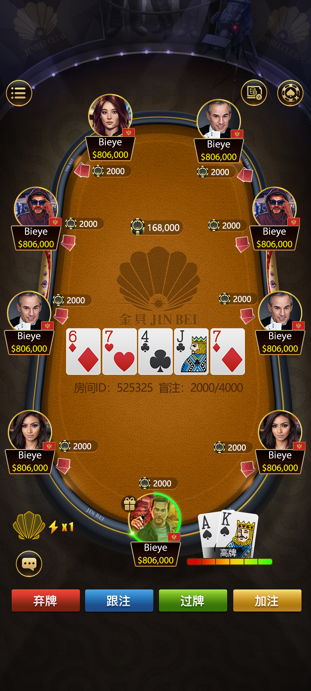
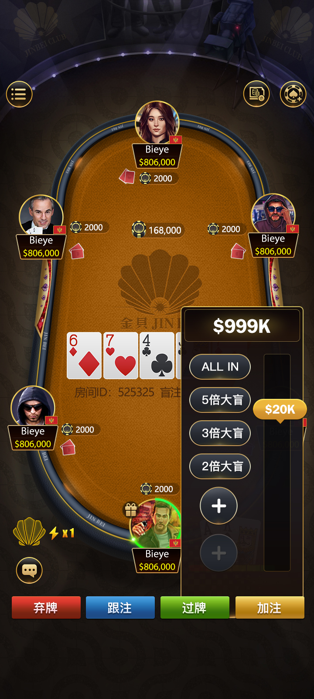
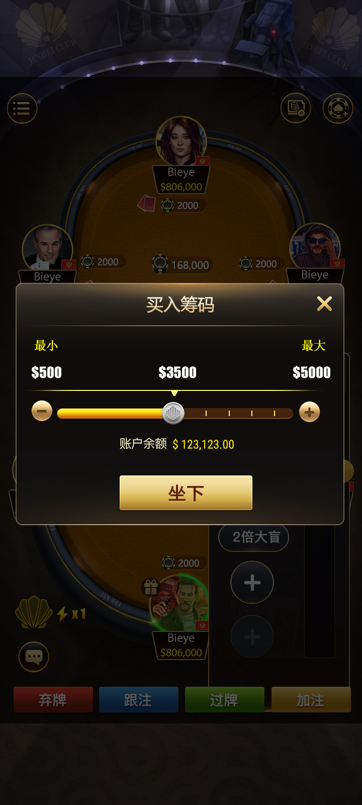
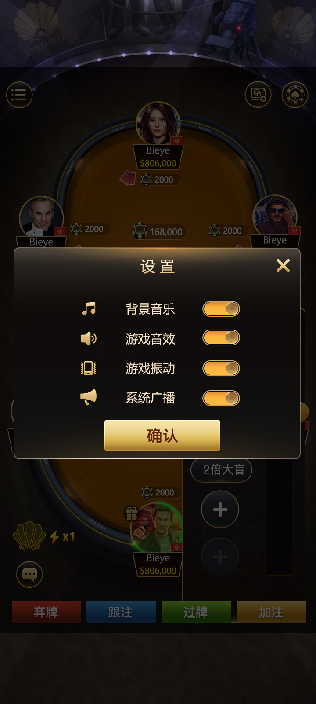
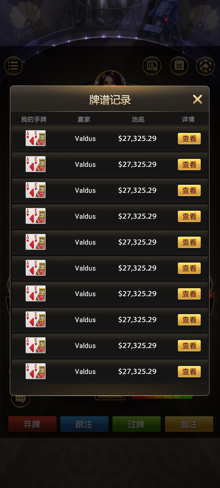
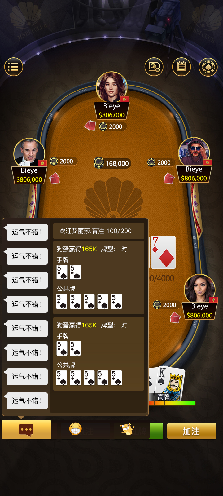

[简体中文](README.md) | [繁體中文](README.zh-TW.md) | [English](README.en.md)

# Unity and C++ Multiplayer Texas Holdem Platform|Texas Hold’em Online Poker Platform

**Complete Texas Hold’em Poker Source Code** · **Texas Hold’em Online Poker Platform**
**Multiplayer Poker Game Server + Lobby + Club + Tournament System** | Unity + C++ | Deployment requires independent technical and compliance review


A complete source code package for a Texas Hold’em online poker platform **proven in real-world commercial operations**.
It supports classic Texas Hold’em and various game variants (AOF/Fast-Fold, Short Deck, SNG, MTT/Multi-Table Tournaments) and integrates features such as a game lobby, club management, agent alliances, voice chat, and an insurance system.
Suitable for customization, commercial deployment, or local operation.


Supports multiple languages ​​(Simplified Chinese, Traditional Chinese, English, Korean, Malay, Japanese, Thai, Indonesian, Vietnamese) and is fully optimized for mobile (iOS/Android).


[Contact us now for an online demo,  deployment support](#Contact-Us)


## ✨ Key Features


- **Diverse Gameplay**: Classic Texas Hold’em, AOF (Fast-Fold), Short Deck, SNG (Sit & Go), and MTT (Multi-Table Tournaments)
- **Lobby & Matchmaking**: Private rooms, games with friends, club matchmaking, and quick join
- **Club & Agent Systems**: Club creation and management, customizable rake, leaderboards, and alliance revenue sharing
- **Real-time Multiplayer**: High-performance synchronization and server-side authoritative validation
- **Social Features**: In-room voice/video chat, emojis, and a gift system
- **Tournaments & Insurance**: Scheduled tournaments, knockout tournaments, insurance purchase options, and achievement systems
- **Operational Tools**: Backend administration, data analytics, and hot-update support


## 📸 Game Screenshots

**Join Game Screen**

**Lobby Interface**

**Game Interface**


**Checkout Screen**

**View Player Interface**
  
**9-Player Table**
  
**Friends Room**
  
**Buy Chips**
  
**In-Game Settings**
                                                                                                      


  
**Match Record**
  
**Chat**


## 🎥 Video Demo


[Open Facebook Link](https://www.facebook.com/share/v/1LHRj4he6A/?mibextid=wwXIfr)
Full Demo: Enter Lobby → Create Room → Real-time Match → Club Management Workflow (10 minutes)


## 🚀 Quick Start


git clone https://github.com/masterai-top/Texas-Hold-em-Poker.git
Client: Open the Unity project to run (supports iOS/Android builds)
Server: Refer to the Makefile to compile and run the C++ project
Database: Import MySQL + Redis scripts


Detailed deployment documentation is available in the `docs/` folder (the full version offers more guidance).

## 🛠 Tech Stack


Client: Unity (C#) – Supports iOS / Android / PC
Server: C++ (High performance, stable)
Database: MySQL + Redis
Networking: High-performance real-time communication protocol


## 💡 Why Choose This Project?


Code validated through actual commercial operation;
not just a demo project
Feature-complete, including a full monetization system (club rake, agent revenue sharing, tournament entry fees, etc.)
Supports multiple languages ​​and mobile platforms; easily adaptable for international users
Deployment technical support provided;
lowers the barrier to launch


## 📜 License & Authorization
This repository is a showcase version intended solely for learning and research purposes.

Please contact us to obtain an official license for commercial use, the complete unencrypted source code package, or technical support.


## 📞 Contact Us


Telegram: @xuzongbin001
Email: masterai918@gmail.com


Thanks for your support (Star)!
Feel free to contact us with any questions.


## ✅ Badges (Build Trust)
```markdown


```
