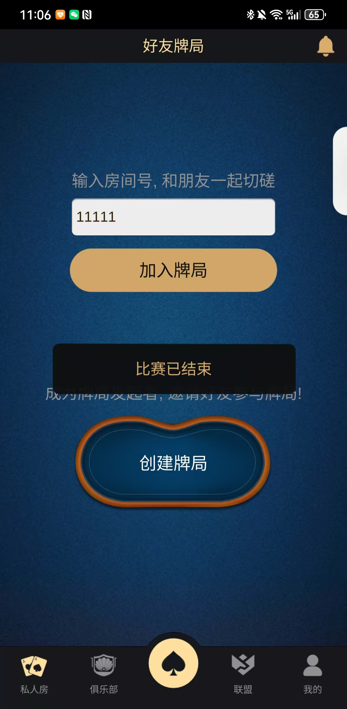
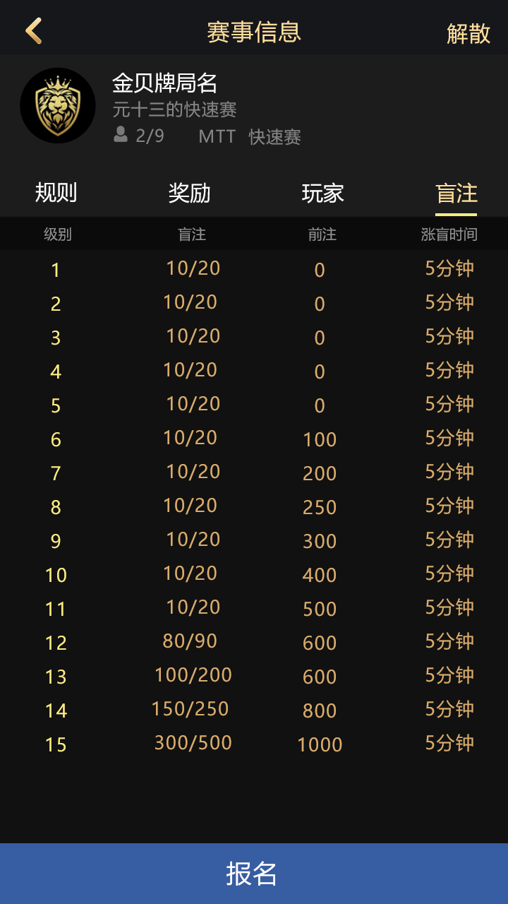
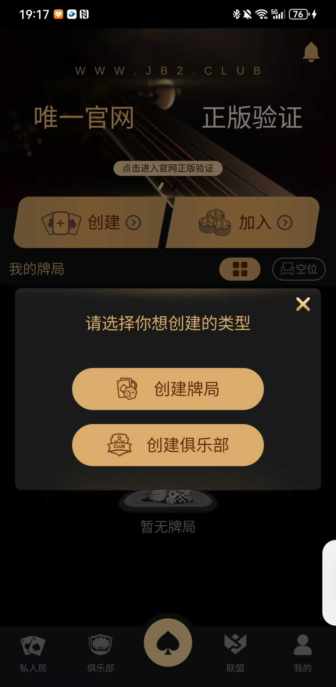
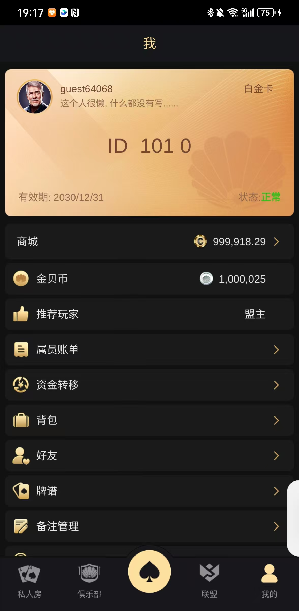
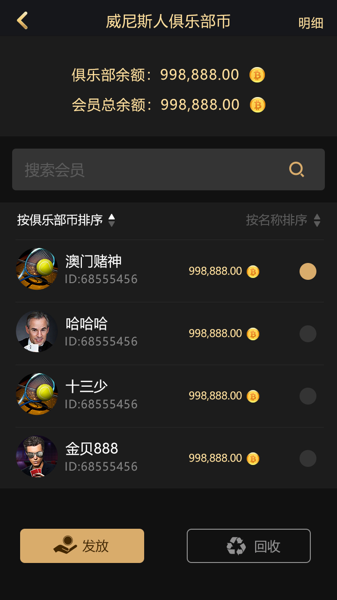

[简体中文](README.md) | [繁體中文](README.zh-TW.md) | [English](README.en.md)

# 德州撲克多人即時平台原始碼

面向**多人即時德州撲克平台**的客戶端、牌局協定與 C++ 服務端工程參考。與同帳號中聚焦俱樂部營運或賽事平台的專案不同，本專案重點是從行動端牌桌到房間狀態、下注訊息、玩家狀態與跨模組協定的完整鏈路。

## 產品是什麼

玩家可進入大廳，建立或加入俱樂部、聯盟、好友局與私人房，並在即時牌桌完成買入、下注、棄牌、結算和離桌。產品截圖展示 MTT 報名/牌桌、個人中心、俱樂部幣、聯盟及好友局等介面。玩法與交付範圍仍應依實際分支、設定與驗收清單為準。

## 主要功能與玩法

- **多人即時牌桌**：房間加入/離開、玩家線上狀態、牌局開始/結束、下注與結算流程。
- **好友局與私人房**：建立私人牌桌，邀請熟人或俱樂部成員參與。
- **俱樂部與聯盟**：建立俱樂部、申請加入、聯盟入口及俱樂部幣等產品模組。
- **賽事入口**：截圖與 `match*.proto.bytes`、賽事頁面展示 MTT、SNG 相關流程；完整賽事規則需結合服務端設定驗收。
- **行動客戶端**：包含 Unity/客戶端腳本、資源與 Android/iOS 設定相關檔案。
- **營運模組**：個人中心、排行、簽到、商城、訂單、推送與後台介面等協定或頁面。

## 真實產品截圖

| 即時牌桌 | 好友私人局 |
| --- | --- |
|  |  |
| MTT 賽事 | 建立俱樂部 |
|  |  |
| 個人中心 | 俱樂部幣 |
|  |  |

[開啟圖文產品頁](https://masterai-top.github.io/Texas-Hold-em-Poker/zh-tw/)

## 可從目錄核實的技術結構

| 層級 | 檔案/目錄 | 說明 |
| --- | --- | --- |
| 牌局邏輯 | `allin.cpp`、`autobet.cpp`、`autofold.cpp`、`gamebanker.h`、`gameend.h` | 下注、自動操作、莊家/結束等牌局邏輯 |
| 房間生命週期 | `userlefttable.*`、`useroffline.*`、`userinfo.*`、`userinfomapprivate.*` | 離桌、離線、玩家資料與私桌映射 |
| 協定層 | `*.proto.bytes`、`GameTcp.tars`、`Push.tars`、`OrderServant.tars` | 大廳、房間、聊天、好友、賽事、訂單與推送協定 |
| 服務端 | `RouterServer.*`、`OrderServer.*`、`Processor.*`、`OuterFactoryImp.*` | 路由、訂單、訊息處理與外部服務適配 |
| 客戶端 | `GameApp.ts`、`GameLoading.ts`、`MsgHandlerModel.ts`、`Login/`、`Assets/` | 客戶端啟動、載入、訊息處理、登入與資源 |
| 資料與營運 | `RankBoard.proto.bytes`、`mall.proto.bytes`、`SignIn.proto.bytes`、`Task.proto.bytes` | 排行、商城、簽到與任務介面定義 |

## 與同帳號專案的定位邊界

- 本專案主關鍵詞：**multiplayer poker source code、real-time poker game、poker protocol、C++ poker server、Unity poker client**。
- 俱樂部營運細節優先連結 Club-Source 專案；賽事平台專題優先連結 Tournament-Event 專案；本頁不重複承諾完整商業方案。

## 聯絡方式

- Telegram：[@xuzongbin001](https://t.me/xuzongbin001)
- Email：[masterai918@gmail.com](mailto:masterai918@gmail.com)

請遵守所在地法律、平台規則、隱私及未成年人保護要求，不得用於非法賭博。

